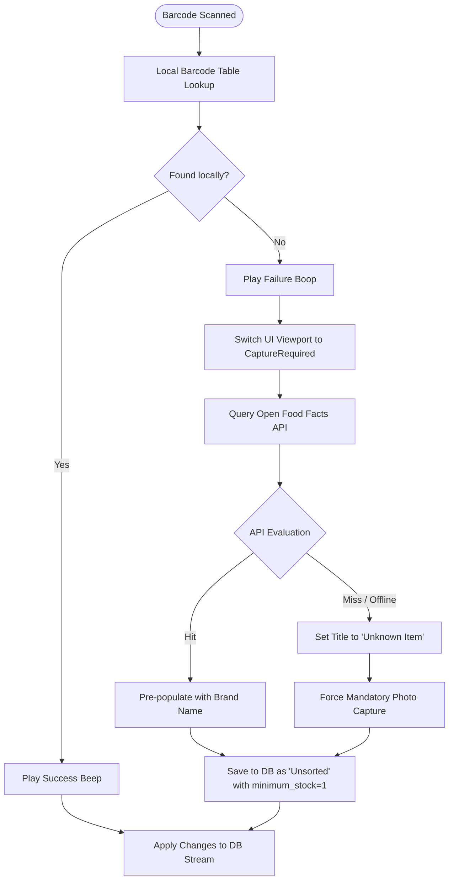

# UI Architecture Specification

This document defines the comprehensive user interface architecture, navigation topologies, and component layout constraints for the application. The Jetpack Compose Android UI layer operates strictly under a **stateless, reactive paradigm** driven directly by continuous SQLite database streams via PowerSync.

---

## 1. Core Architectural Philosophy: The Pure Stream

The application completely rejects volatile, in-memory view model state machines, mutable lists caches, or transient UI frameworks for tracking domain data.

```
┌────────────────────────────────────────────────────────┐
│ Jetpack Compose UI                                     │
│ (Re-renders automatically when database stream emits)  │
└───────────────────────────┬────────────────────────────┘
                            │
                 Reads Live │ Writes Mutations
              SQL Flowables │ Instantly
                            ▼
┌────────────────────────────────────────────────────────┐
│ PowerSync / Local SQLite DB                            │
│ (Single Source of Truth, Household Synchronized)       │
└────────────────────────────────────────────────────────┘
```

1. **Zero Volatile State:** If an asset or metric needs to be rendered, the UI queries the local SQLite engine using specialized view reactive flows.
2. **Instant Mutational Writing:** Any interactive gesture (taps, steppers, swipes, hardware scans) immediately formats a database write transaction. The UI does not update its own state manually; it relies entirely on the resulting database stream mutation to force a composition redraw.
3. **Cross-Device Determinism:** Since PowerSync replicates transactions across all household devices bound to the shared `household_id`, the UI layer treats remote database sync packages identically to local user interaction.

---

## 2. Root Navigation Engine & Global State Controller

Application root routing is completely hijacked by the global `current_state` row inside the `households` table. The application `NavHost` evaluates this continuous stream to swap out the root interface, enforcing total systemic alignment across all synchronized household devices.

### 2.1 State Matrix Routing Rules

| `households.current_state` Value | Primary Composable | Behavioral Rule                                                                | Escape Hatch Mechanics                                                                                    |
| :------------------------------- | :----------------- | :----------------------------------------------------------------------------- | :-------------------------------------------------------------------------------------------------------- |
| **`IDLE`**                       | `InventoryScreen`  | Standard inventory browsing, storage auditing, and at-home depletion tracking. | One can start shopping                                                                                    |
| **`SHOPPING`**                   | `ShoppingScreen`   | High-visibility procurement checklist. Enforces shopping velocity.             | Experimental `SearchBar` overlay allowing global database querying and deep navigation to `DetailScreen`. |
| **`UNLOADING`**                  | `UnloadingScreen`  | Transactional audit grid of brought-home items. Locks application entry.       | Confirmation barrier requiring explicit checkbox confirmation or forced bypass override.                  |

### 2.2 Phase Switch Triggers

Transitions between states are explicitly triggered via manual command buttons.

---

## 3. Screen Specifications & Interaction Topologies

### 3.1 Inventory Screen (`IDLE` State)

The primary interface for standard household operations, optimized for rapid, low-friction entry of item consumption.

- **Layout Composition:** A monolithic vertical `LazyColumn` incorporating native Compose `stickyHeader` components mapped directly to `product_groups`.
- **Visual Transitions:** Dynamic category re-sorting and layout alterations use `Modifier.animateItem()` to naturally slide rows into new grouping frames without list jarring.
- **Consumption Mechanics:**
  1. **Quick-Swipe Gesture:** Swiping an item row horizontally from right-to-left triggers an immediate database decrement command (`current_stock = current_stock - 1` if `current_stock > 0`). Accompanied by a haptic feedback click.
  2. **Detail Navigation:** A standard tap anywhere on the row layout navigates directly to that product's full `DetailScreen`.
- **Continuous Rapid-Fire Consumption Scanner:**
  - Triggered via a high-visibility Floating Action Button (FAB).
  - Slides up a bottom-sheet viewport capturing a continuous CameraX frame stream.
  - When a recognized barcode crosses the target box, the application executes a `-1` mutation on `current_stock`, if `current_stock > 0`, fires a high-pitched supermarket success beep, and _leaves the camera active_.
  - A dual-gate throttling mechanism on the camera analyzer is implemented: a time-based debounce per unique payload, combined with a mandatory "frame-clear" reset.
    - The Cooldown Gate: Once a barcode payload is read, that specific string is locked for 3 seconds. If one is hovering over the same milk carton, nothing happens.
    - The Clear-Frame Gate: The lock resets immediately if the camera frame detects zero barcodes for more than 400 milliseconds. This means if one is scanning three identical cans of chopped tomatoes, one can rapidly whip them across the camera view one by one without waiting for a 3-second timer.
  - After scanning a snackbar at the bottom displays the new, decremented amount of the product. An action in the snackbar should open the products detail page where one can make adjustments e.g. completely correct the amount as one is already standing in front of them.
- **Shopping Starts:** A prominent "Start Shopping" button is always visible in the top right screen corner. Tapping it executes a direct database command and activates the shopping screen for all household devices:

```
household_state <- 'SHOPPING'
```

### 3.2 Active Shopping Screen (`SHOPPING` State)

A highly structured, high-contrast display designed for high-distraction supermarket environments. Driven by distinct localized sub-queries on the `product_kinds` layout.

```
┌────────────────────────────────────────────────────────┐
│ [ Search Bar Component ]                               │
├────────────────────────────────────────────────────────┤
│ ▼ Active Shopping List                                 │
│ [ ] Milk 0 / 3                             [ - ] [ + ] │
│ [ ] Eggs 1 / 12                            [ - ] [ + ] │
├────────────────────────────────────────────────────────┤
│ ▼ Impulse Buys                                         │
│ [x] Chocolate Bar 1                        [ - ] [ + ] │
├────────────────────────────────────────────────────────┤
│ ▼ Struck-Through Cart Items                            │
│ [x] Bread 2 / 2                            [ - ] [ + ] │
└────────────────────────────────────────────────────────┘
```

#### 3.2.1 The Section Splits

The view divides the incoming continuous stream into three prioritized database-filtered sub-lists:

1. **Active Shopping List:** `WHERE quantity_to_buy > 0 AND pending_stock < quantity_to_buy`
2. **Struck-Through Cart Items:** `WHERE quantity_to_buy > 0 AND pending_stock >= quantity_to_buy`
3. **Unplanned Impulse Buys:** `WHERE quantity_to_buy = 0 AND pending_stock > 0`

#### 3.2.2 Carting Interaction Patterns

- **The Full-Fulfillment Shortcut:** A single direct tap on any row item immediately updates the database to fulfill the full requested item deficit (`pending_stock = quantity_to_buy`), causing it to instantly slide down to the Struck-Through section via database stream calculation.
- **Granular Stepper Adjustments:** Small explicit `+` and `-` buttons are paired with the fraction indicator, allowing the shopper to log partial availability or overfulfillment.
- **Inline Procurement Barcode Scanner:** Activating the hardware scanner allows the user to grab items and scan their barcodes. A successful scan increments `pending_stock` by 1. If the item had a `quantity_to_buy = 0`, it instantly spawns into the _Unplanned Impulse Buys_ group.
- **Shopping Finishes:** A prominent "Finish Shopping" button is always visible in the top right screen corner. Tapping it executes a direct database command and activates the unloading screen for all household devices:

```
household_state <- 'UNLOADING'
```

#### 3.2.3 The Search Bar Escape Hatch

An integrated experimental Compose `SearchBar` sits anchored at the screen top. When activated, it expands full-screen over the active list.

- It outputs a real-time text-filtered stream against the entire global `product_kinds` database.
- Tapping a search result item provides an interactive card displaying a Correction Override button (force-adding the item to the active purchase list) and an administrative anchor link to jump out directly to the product's full `DetailScreen`.

### 3.3 Unloading Audit Screen (`UNLOADING` State)

A specialized data reconciliation interface executed on returning home. It ensures that everything purchased actually lands inside the physical pantry inventory.

#### 3.3.1 Row Design & Accounting Formula

Every single product containing items in transit (`WHERE pending_stock > 0`) is structured into a line-item auditing grid rendering an explicit balance formula:

`current_stock + pending_stock = total`

```
┌────────────────────────────────────────────────────────┐
│ [ ] Product Name    current + pending = total  [-] [+] │
└────────────────────────────────────────────────────────┘
```

#### 3.3.2 Acknowledgement Lock Down

- **Checkbox State Mechanics:** To preserve statelessness, the row's checkbox is wired directly to the `unload_open` column inside the `product_kinds` table.
- **The Editing Lock:** When `unload_open == false` (the checkbox is ticked), the line item is visually greyed out and the stepper adjustment buttons are explicitly deactivated. The row must be unchecked to re-enable quantity modifications.
- **The Validation Gate:** Tapping the top-right "Submit Unloading" button queries for any remaining rows where `unload_open == true`. If found, a Compose `AlertDialog` warns the user of unchecked items. Upon final authorization, a unified database transaction handles consolidation:

```
current_stock <- current_stock + pending_stock
pending_stock <- 0
unload_open <- false
household_state <- 'IDLE'
```

### 3.4 Product Detail Screen

A comprehensive data configuration console for a single `product_kinds` item that bypasses state lockdown rules.

- **Absolute Mutability Policy:** The Detail Screen remains completely mutable at all times, across all phases of the global `households`. Users can rewrite titles, reassign categories, edit barcode arrays, change `current_stock` inventory counts or change `minimum_stock` thresholds even during active shopping execution.

---

## 4. Hardware & API Ingestion Pipeline

When the device's camera module tracks an unknown barcode, the onboarding process follows a strict fallback priority model designed to maximize speed while protecting the integrity of the synchronized database.



1. **Local Lookup:** Executes an `O(1)` query on the `barcodes` table.
   - _Hit:_ Plays a crisp supermarket success _beep_. Updates database metrics.
   - _Miss:_ Plays a low failure _boop_ sound. The application instantly switches its internal camera composition flag from `Scanning` to `CaptureRequired` without breaking the CameraX lifecycle stream.
2. **External API Evaluation:** The application issues an asynchronous network call to the _Open Food Facts API_.
   - _API Success:_ Spawns a new `product_kinds` record pre-populating the title text field with the verified brand string. `product_groups` defaults to an `"Unsorted"` system category.
   - _API Timeout / Offline / Cache Miss:_ Sets the default title string to `"Unknown Item"`. The user is explicitly blocked from completing the transaction until they press the on-screen shutter button again, forcing a physical camera photo capture of the item package. The asset path is bound to the new unsorted database entry (`product_kinds.image_path`).
3. **Procurement Default Bias:** All newly generated "Unsorted" items initialized via rapid pipeline ingestion automatically default to `minimum_stock = 1`. This asserts that any new item found in the wild is treated instantly as a permanent household staple.

---

## 5. Automated Engine & Data Lifecycle Rules

### 5.1 Automated Convergence Engine

A reactive database-level listener continuously observes modifications to `current_stock`. The moment `current_stock` alters, the engine executes an immediate recalculation of `quantity_to_buy` across the affected row context:

```
quantity_to_buy = max(0, minimum_stock - current_stock)
```

This computation operates entirely inside the local database layer, ensuring that incoming synchronization packets instantly align the UI of all active family devices simultaneously.

### 5.2 Soft-Delete Data Resurrection

Items are never deleted completely but flagged via a `deleted_at` timestamp column.

- If a family member physically scans an item containing an active `deleted_at` flag at a grocery store, the `deleted_at` value is nullified and the historical item is reinstated.
- **The UX Anchor:** The camera plays the standard success beep, but the UI simultaneously deploys a transient **Snackbar Component** anchored at the viewport base: `"Restored '[Product Name]' from archive."` featuring an interactive action label that opens the products full `DetailScreen` for parameter verification and immediate adjustment.
